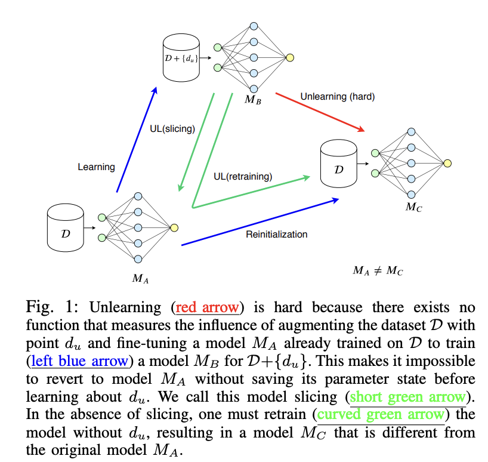

# Machine Unlearning

Machine unlearning is a concept that mirrors the human ability to forget, granting Artificial Intelligence (AI) systems the power to discard specific information. It is the converse of machine learning that allows the models to unlearn or forget certain aspects of their training data. It holds promise not only for complying with regulations but also for rectifying factually incorrect information within a model.
Authors in paper [2] addresses the difficulty of removing a user’s data from machine learning models once it has been included. It introduces a framework called SISA training to expedite the unlearning process by strategically limiting the influence of a data point during training. The paper evaluates SISA training across various datasets and demonstrates its effectiveness in reducing computational overhead associated with unlearning, while maintaining practical data governance standards.

## Motivation

These days deep learning models are trained on a large dataset. It’s difficult for users to revoke access and request deletion of their data once shared online. ML models potentially memorizes the data that raises privacy concerns. Consider another example where an employee leaves the company and the employee wants the company removed all his information from the trained model. 
However, the challenge is we can not train the model from scrath as it is time consuming and cost inefficient. Moreover, some of the used data may be changed later. For instance, consider the example "Man City is the current winner of uefa champion league." However, this information will change every year. So, model should update this information by forgetting the previous information. Therefore, unlearning data from ML models is notoriously challenging, yet crucial for privacy protection. In this context, the paper introduces SISA (Sharded, Isolated, Sliced, and Aggregated) training, a framework designed to expedite the unlearning process and reduce computational overhead.

## Formalizing Machine Unlearning
Unlearning is difficult due to the stochastic and complex nature of ML training methods. There’s no clear method to measure the impact of a single data point on the model’s parameters. Moreover, randomness in training, such as batch sampling and non-deterministic parallelization, complicates unlearning. Model updates reflect all prior updates, making it hard to isolate the influence of a single data point. Authors of paper [2] formalize machine unlearning:

**Machine Unlearning**: Let $\mathcal{D} = {d_i:i \in U}$ denote the training set collected from population U. Let $\mathcal{D'}=\mathcal{D} \cup d_u$. Let $D_M$ denote the distribution of models learned using mechanism $M$ on $\mathcal{D'}$ and then unlearning $d_u$. Let $D_{real}$ be the distribution of models learned using $M$ on $\mathcal{D}$. the mechanism $M$ facilitates unlearning when these two distribution are identical.

There are two aspects of this definition: $(i)$ the definition captures inherent stochasticity in learning: it is possible for multiple hypotheses to minimize empirical risk over a training set and ($ii$) the definition does not necessarily require that the owner retrain the model $M'$ from scratch on $\mathcal{D} \ d_u$, as long as they are able to provide evidence that model $M'$ could have been trained from scratch on $\mathcal{D'} \ d_u$. 
For illustration, consider the following figure. Suppose we have a given dataset $\mathcal{D}$ and we want to train two DNN models $M_A$ and $M_C$. Now if we add a new data point $d_u$ to the training data $\mathcal{D}$, we get new dataset $\mathcal{D'}=\mathcal{D} \cup d_u$. Now using this dataset $\mathcal{D'}$, we can train a model $M_B$ in various way. First, we can use the parameter of $M_A$ that is trained on $\mathcal{D}$ and continue the training on $d_u$ to obtain $M_B$. However, it is difficult to understand the influence of $d_u$ in the parameter of $M_B$ and invert the procedure to get back $M_A$ unless we save a copy of $M_A$. One convincing way to obtain plausible deniability and ensure the removal of $d_u$ is to retrain the model from scratch without $d_u$ (keeping all hyperparameter same).  It is conceivable that the parameters of $M_A$ and $M_C$ are similar (despite stochasticity in learning) and it is
desired for their performance (in terms of test accuracy) to be comparable. 

  

Goals of Unlearning are as follows:

- Intelligibility: The unlearning strategy should be conceptually easy to understand and implement.
- Comparable Accuracy: Even if the baseline accuracy degrades due to unlearning (e.g., removing a fraction of training points or prototypical points), any new strategy should aim to introduce only a small accuracy gap compared to the baseline.
- Reduced Unlearning Time: The strategy should be more efficient in terms of time and computational resources than the baseline approach.
- Provable Guarantees: Similar to the baseline, any new strategy must provide provable guarantees that unlearned points do not influence model parameters.
- Model Agnostic: The new unlearning strategy should work across various types of models, regardless of their complexity or nature.
- Limited Overhead: The new strategy should not introduce additional computational overhead beyond what is already required for training procedures.

## Conclusion & Discussion

In conclusion, the paper [2] introduces a framework to expedite the unlearning process by strategically limiting the influence of a data point in the training procedure. Moreover, it is applicable to any learning algorithm but particularly beneficial for stateful algorithms like stochastic gradient descent for deep neural networks.

**Computational Overhead Reduction**: Demonstrates how SISA training significantly reduces the computational overhead associated with unlearning. Even it shows improvement in scenarios where unlearning requests are uniformly distributed across the training set.

**Practical Data Governance**: Contributes to practical data governance by enabling machine learning models to unlearn data efficiently, thereby supporting the right to be forgotten as mandated by privacy regulations like GDPR.

**Evaluation Across Datasets**: Provides an extensive evaluation of the SISA training approach across several datasets from different domains. This shows its effectiveness in handling streams of unlearning requests with minimal impact on model accuracy.

