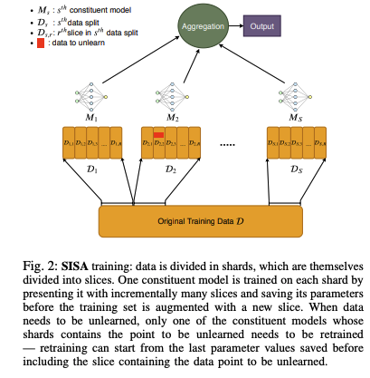
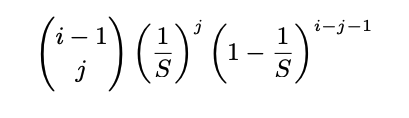
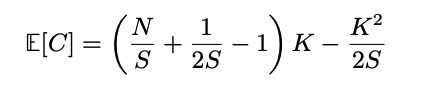
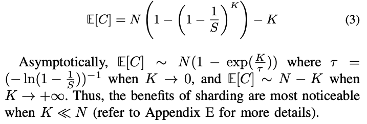
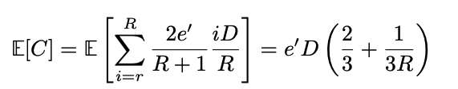
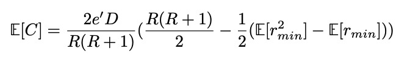

# Machine Unlearning

Machine unlearning is a concept that mirrors the human ability to forget, granting Artificial Intelligence (AI) systems the power to discard specific information. It is the converse of machine learning that allows the models to unlearn or forget certain aspects of their training data. It holds promise not only for complying with regulations but also for rectifying factually incorrect information within a model.
Authors in paper [2] addresses the difficulty of removing a user’s data from machine learning models once it has been included. It introduces a framework called SISA training to expedite the unlearning process by strategically limiting the influence of a data point during training. The paper evaluates SISA training across various datasets and demonstrates its effectiveness in reducing computational overhead associated with unlearning, while maintaining practical data governance standards.

## Motivation

These days deep learning models are trained on a large dataset. It’s difficult for users to revoke access and request deletion of their data once shared online. ML models potentially memorizes the data that raises privacy concerns. Consider another example where an employee leaves the company and the employee wants the company removed all his information from the trained model. 
However, the challenge is we can not train the model from scrath as it is time consuming and cost inefficient. Moreover, some of the used data may be changed later. For instance, consider the example "Man City is the current winner of uefa champion league." However, this information will change every year. So, model should update this information by forgetting the previous information. Therefore, unlearning data from ML models is notoriously challenging, yet crucial for privacy protection. In this context, the paper introduces SISA (Sharded, Isolated, Sliced, and Aggregated) training, a framework designed to expedite the unlearning process and reduce computational overhead.

## Formalizing Machine Unlearning
Unlearning is difficult due to the stochastic and complex nature of ML training methods. There’s no clear method to measure the impact of a single data point on the model’s parameters. Moreover, randomness in training, such as batch sampling and non-deterministic parallelization, complicates unlearning. Model updates reflect all prior updates, making it hard to isolate the influence of a single data point. Authors of paper [2] formalize machine unlearning:

**Machine Unlearning**: Let $\mathcal{D} = {d_i:i \in U}$ denote the training set collected from population U. Let $\mathcal{D'}=\mathcal{D} \cup d_u$. Let $D_M$ denote the distribution of models learned using mechanism $M$ on $\mathcal{D'}$ and then unlearning $d_u$. Let $D_{real}$ be the distribution of models learned using $M$ on $\mathcal{D}$. the mechanism $M$ facilitates unlearning when these two distribution are identical.

There are two aspects of this definition: $(i)$ the definition captures inherent stochasticity in learning: it is possible for multiple hypotheses to minimize empirical risk over a training set and ($ii$) the definition does not necessarily require that the owner retrain the model $M'$ from scratch on $\mathcal{D} - d_u$, as long as they are able to provide evidence that model $M'$ could have been trained from scratch on $\mathcal{D'} - d_u$. 
For illustration, consider the following figure. Suppose we have a given dataset $\mathcal{D}$ and we want to train two DNN models $M_A$ and $M_C$. Now if we add a new data point $d_u$ to the training data $\mathcal{D}$, we get new dataset $\mathcal{D'}=\mathcal{D} \cup d_u$. Now using this dataset $\mathcal{D'}$, we can train a model $M_B$ in various way. First, we can use the parameter of $M_A$ that is trained on $\mathcal{D}$ and continue the training on $d_u$ to obtain $M_B$. However, it is difficult to understand the influence of $d_u$ in the parameter of $M_B$ and invert the procedure to get back $M_A$ unless we save a copy of $M_A$. One convincing way to obtain plausible deniability and ensure the removal of $d_u$ is to retrain the model from scratch without $d_u$ (keeping all hyperparameter same).  It is conceivable that the parameters of $M_A$ and $M_C$ are similar (despite stochasticity in learning) and it is
desired for their performance (in terms of test accuracy) to be comparable. 

  

Goals of Unlearning are as follows:

- Intelligibility: The unlearning strategy should be conceptually easy to understand and implement.
- Comparable Accuracy: Even if the baseline accuracy degrades due to unlearning (e.g., removing a fraction of training points or prototypical points), any new strategy should aim to introduce only a small accuracy gap compared to the baseline.
- Reduced Unlearning Time: The strategy should be more efficient in terms of time and computational resources than the baseline approach.
- Provable Guarantees: Similar to the baseline, any new strategy must provide provable guarantees that unlearned points do not influence model parameters.
- Model Agnostic: The new unlearning strategy should work across various types of models, regardless of their complexity or nature.
- Limited Overhead: The new strategy should not introduce additional computational overhead beyond what is already required for training procedures.

## SISA Training Approach

Figure below shows the SISA training approach. SISA training replicates the model being learned multiple times. Each replica receiving a disjoint subset of the dataset (similar to distributed training strategies). Each replica is referred to as a “constituent model.” Unlike traditional strategies, SISA training does not allow information flow between constituent models. Gradients computed on each constituent are not shared between different constituents. This isolation ensures that the influence of a specific shard (and its data points) is restricted to the model trained using it. Each shard is further partitioned into slices. Constituent models are trained incrementally (in a stateful manner) with an increasing number of slices. At inference, the test point is fed to each constituent, and their responses are aggregated (similar to ML ensembles). When a data point needs to be unlearned (e.g., due to privacy concerns or model updates), only the constituent model containing that data point is affected. Retraining can start from the last parameter state saved before including the slice with the unlearned data point. Only the models trained using the slice containing the unlearned point need to be retrained. We can divide the procedure in 4 parts: sharding, isolation, slicing, and aggregation.

**Sharding**: The dataset $\mathcal{D}$ is uniformly partitioned into $S$ shards ($D_k$) such that each shard contains a portion of the dataset. No data point belongs to more than one shard. The training cost can be distributed by dividing the dataset into smaller parts and training models on each part separately. This allows for parallelism across shards. If a user requests to unlearn a specific data point $d_u$, the service provider needs to locate the shard ($D_u$) that contains that data point. Then it retrains the model on the remaining data in that shard ($D_u - d_u$) to produce a new model ($M_{u}$). This process is faster than retraining the model from scratch on the entire dataset ($D - d_u$). The time required for retraining the model from scratch on the baseline dataset ($D - d_u$) is far greater than the time required for retraining on the smaller shard ($D_u - d_u$). This results in an expected speed-up of $S×$.

**Isolation**: Isolation could potentially degrade the generalization ability of the overall model beacuse it might not capture the full complexity of the data. However, through empirical demonstration, it is shown that this degradation doesn't happen in practice for certain learning tasks.

**Slicing**: Each shard's data $D_k$ is divided into $R$ disjoint slices, ensuring that each slice contains a portion of the shard's data. Autors follow incremental training:
   - At each step, the model is trained with an increasing number of slices, starting from one slice up to all slices.
   - The parameter state of the model is saved after each step.
   - Training for each step $i$:
     1. Train the model with random initialization using only slice $D_{k,i}$, for $e_i$ epochs, resulting in model $M_{k,i}$.
     2. For step $i > 1$, train the model $M_{k,i-1}$ using slices $D_{k,1} ∪ D_{k,2} ∪ ... ∪ D_{k,i}$, for $e_i$ epochs, resulting in model $M_{k,i}$.
     3. Repeat this process until all slices are included, obtaining the final model $M_{k,R} = M_{k}$.

Now, if a user requests to unlearn a specific data point $d_u$ from shard $D_k$, it locates the slice containing $d_u$, referred to as $D_{k,u}$. Then it performs training from that slice onwards, excluding $d_u$. That results in a new model $M_{k,u}$. For a single unlearning request, this method provides a best-case speed-up of up to $\frac{2R}{R+1}$ times compared to using the strategy without slicing.

**Aggregation**: The aggregation strategy is closely tied to how data is partitioned to form shards. It targets to maximize the joint predictive performance of constituent models.
This strategy should not rely on the training data to ensure that it does not need to be unlearned in some cases. In the absence of knowledge about which points will be the subject of unlearning requests, a uniform data partitioning and a simple label-based majority vote strategy are considered the best approach. This strategy ensures that each constituent model contributes equally to the final outcome. It also satisfies both requirements mentioned above. However, in scenarios where constituent models assign high scores to multiple classes, the majority vote aggregation might lose information about runner-up classes. To address this, a refinement strategy is evaluated where the entire prediction vectors (post-softmax) from constituent models are averaged. Then the label with the highest value is selected.

  

## Measuring Time Analysis

**Measuring time for sharding**: For sequential setting, authors calculate the expectation of the number of points needed to be used for retraining. If the sharding is uniform, then each model has (roughly) the same number of initial training data points $\frac{N}{S}$. It is obvious that the first unlearning request will result in retraining of $\frac{N}{S}-1$ points for the one shard that is affected. For the second unlearning request, there will be two cases: the shard affected in the first unlearning request is affected again, which will result in retraining $\frac{N}{S}-1$ data points with a probability $\frac{1}{S}$, or any other shard is impacted resulting in retraining $\frac{N}{S}-1$ data points with probability $1-\frac{1}{S}$. Thus, inductively, we can see that for the $i^{th}$ unlearning request, the probability that $\frac{N}{S}-1-j$ points (for $0 \le j \le i − 1$) are retrained is:

  

Using binomial theorem, expected number of points to be retrained is:

  

Alternatively for batch setting, service provider S could aggregate unlearning requests into a batch, and service the batch. In this case the expected cost is:

  

**Measuring time for slicing**: For sequential setting, we need to find the expectation of the number of samples that will need to be retrained for a single unlearning request. The expected number of samples that need to retrain is:

  

which is an upper bound on the expected number of points to be retrained for a single unlearning request.

Similarly, for batch setting, we need to find the expected minimum value over multiple draws of a random variable to compute the index of the slice from which we will have to restart training. The minimum slice index (among all slices affected by $K$ unlearning requests) is computed under the assumption that multiple unlearning requests are sampled from a uniform distribution with replacement. The expected cost of this setting is:

  

## Evaluation
Model is evaluated on MNIST, Purchase, SVHN, CIFAR-100, ImageNET, and mini-imagenet dataset. Results are as follows:

**Impact of sharding**: Impact of sharding can be found in figure below. Despite providing similar benefits to batch $K$ and $\frac{1}{S}$ fraction baselines, SISA training shows more accuracy degradation for complex tasks like ImageNet. While consistently outperforming the $\frac{1}{S}$ fraction baseline, SISA training still faces challenges. With label aggregation results in an average top-5 accuracy degradation of 16.14 PPs. Varying the aggregation strategy mitigates this gap (Average improvements of 1.68 PPs in top-1 accuracy and 4.37 PPs in top-5 accuracy). It emphasizes the importance of ensuring each shard contains a sufficient number of data points to maintain high accuracy in constituent models.

**Impact of slicing**: From figure below, we observe that slicing does not have detrimental impact on model accuracy in comparison to the approach without slicing if the training
time is the same for both approaches. It is clear that slicing reduces the retraining time so long as the storage overhead for storing the model state after adding a new slice is acceptable.
**Combination of sharding and slicing**: From figure below, it can be shown that a combination of sharding and slicing induces the desired speed-up for a fixed number of unlearning requests
(0.003% the size of the corresponding datasets). Note that, the speed-up grows rapidly with an increase in S, but increasing S provides marginal gains in this regime.

## Distributional Knowledge

## Conclusion & Discussion

In conclusion, the paper [2] introduces a framework to expedite the unlearning process by strategically limiting the influence of a data point in the training procedure. Moreover, it is applicable to any learning algorithm but particularly beneficial for stateful algorithms like stochastic gradient descent for deep neural networks.

**Computational Overhead Reduction**: Demonstrates how SISA training significantly reduces the computational overhead associated with unlearning. Even it shows improvement in scenarios where unlearning requests are uniformly distributed across the training set.

**Practical Data Governance**: Contributes to practical data governance by enabling machine learning models to unlearn data efficiently, thereby supporting the right to be forgotten as mandated by privacy regulations like GDPR.

**Evaluation Across Datasets**: Provides an extensive evaluation of the SISA training approach across several datasets from different domains. This shows its effectiveness in handling streams of unlearning requests with minimal impact on model accuracy.

