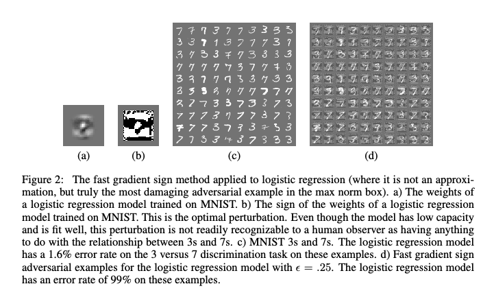
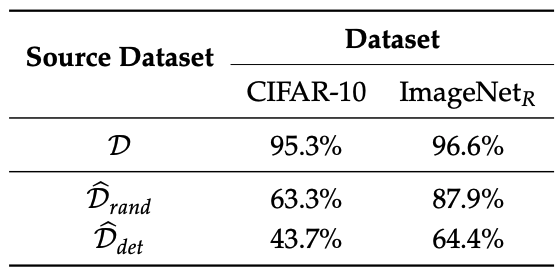

# Paper 30

# Paper 31 (Explaining and Harnessing Adversarial Examples)

## Motivation

Despite the success of deep neural networks, they are vulnerable to adversarial examples - inputs crafted by applying small, intentional perturbations that cause the model to misclassify them with high confidence. An example of such is shown in Figure-1. Previously researchers attempt at explaining the phenomenon of adversarial examples focused on the extreme non-linearity and overfitting of neural networks. They also believed that adversarial examples are rare and finely tile the input space like rational numbers among the reals. In this work, author investigate this two commonly accepted notions. Particularlly, this work aims to understand the root cause of adversarial examples and explore ways to mitigate their impact. 

  

<em>Figure 1: A demonstration of fast adversarial example generation applied to GoogLeNet on ImageNet. By adding an imperceptibly small vector whose elements are equal to
the sign of the elements of the gradient of the cost function with respect to the input. </em>

## Methodology

__Explaining Adversarial Examples__

First, authors argue that the primary cause of neural networks' vulnerability to adversarial perturbations is their linear nature, rather than their non-linearity or overfitting, as previously hypothesized. They propose a linear explanation for the existence of adversarial examples.

In many problems, the precision of individual input features is limited. For example, digital images often use only 8 bits per pixel, discarding information below 1/255 of the dynamic range. Because the precision of the features is limited, it is not rational for the classifier to respond differently to an input `x` and an adversarial input `x̃ = x + η` if every element of the perturbation `η` is smaller than the precision of the features.

__Simple Linear Model__: Consider the dot product between a weight vector `w` and an adversarial example `x̃`: wT `x̃` = wT `x` + wTη
The adversarial perturbation η causes the activation to grow by wT η. We can maximize this increase subject to the max norm constraint on η by assigning η = sign(w). If w has n dimensions and the average magnitude of an element of the weight vector is m, then the activation will grow by mn. It does not grow with the dimensionality of the problem, but the change in activation caused by perturbation by η can grow linearly with n, then for high-dimensional problems, we can make many infinitesimal changes to the input that add up to one large change to the output. This happen because ||η||∞. 

This explanation shows that a simple linear model can have adversarial examples if its input has sufficient dimensionality. The authors argue that neural networks, which are intentionally designed to behave linearly for optimization purposes, are also vulnerable to adversarial perturbations due to their linear nature.

__Complex Deep Model__: Let `x` be the input, `θ` be the model parameters, `y` be the targets, and `J(θ, x, y)` be the cost function. The "fast gradient sign method" for generating adversarial examples is: 
  $$η = ϵ × sign(∇_x J(θ, x, y))$$
Here ϵ is a small constant, and sign(∇_x J(θ, x, y)) is the sign of the gradient of the cost with respect to the input. The perturbed input `x̃` = x + η is likely to be misclassified. 

__Adversarial Training__

The authors propose adversarial training as a way to regularize models and improve their robustness against adversarial examples. This training procedure involves exposing the model to both clean and adversarial examples during the training process.

__Simple Linear Model__: For linear models, such as logistic regression, the fast gradient sign method is exact. Consider a binary classification problem with labels `y ∈ {-1, 1}`, where the model computes the probability of the positive class as:

  $$P(y = 1 | x) = σ(w^{T} x + b)$$

Here, σ(z) is the logistic sigmoid function. To train the model, the objective of adversarial training is to minimize the following equation:

  $$E_{x, y \sim p_{data}} [ζ(y(||w||_1 - w^T x - b))]$$

where ζ(z) = log(1 + exp(z)) is the softplus function. This key difference between this method and L1 regularization is ***the training cost which is added (this method) instead of subracting (L1-regularization) from the model's activation during the training***. However, in underfitting scenarios, adversarial training could worsen underfitting. L1 weight decay persists even in cases of good margin, making it more "worst-case" than adversarial training. In another word, we can interpret this as learning to play an adversarial game or minimizing an upper bound on the expected cost over noisy samples with noise from U(-ε, ε) added to the inputs.

__Deep Model__: For deep model, the authors propose adversarial training, where the model is trained on a mixture of clean and adversarial examples:

  $$\overline{J}(θ, x, y) = αJ(θ, x, y) + (1 - α)J(θ, x + sign(∇_x J(θ, x, y)))$$
  
where α controls the balance between clean and adversarial examples.

The key idea is to continually update the supply of adversarial examples to make them resistant to the current version of the model. This approach means that the model is trained on a mixture of clean and adversarial examples, with the adversarial examples being generated on-the-fly using the fast gradient sign method.

Authors also show that:

- During training, the model learns to resist adversarial perturbations by adjusting its parameters to minimize the adversarial objective function. This can be seen as a form of active learning, where the model requests labels on new points (adversarial examples) to improve its robustness.
- This training can provide an additional regularization benefit beyond that provided by techniques like dropout.
- This can improve the model's robustness against adversarial examples without sacrificing accuracy on clean inputs.

## Experimenation Results

__Linear Model Training__

- The fast gradient sign method reliably causes linear models, such as softmax regression, to have a high error rate on adversarial examples.
- For example, on the MNIST dataset, a shallow softmax classifier achieved an error rate of 99.9% with an average confidence of 79.3% on adversarial examples generated with ε = 0.25.
- Adversarial training for linear models can be seen as minimizing the worst-case error when the data is perturbed by an adversary, similar to L1 regularization.
- However, adversarial training differs from L1 weight decay in that the penalty can eventually disappear if the model learns to make confident enough predictions, while L1 weight decay overestimates the damage an adversary can do.
- An example of the results is shown in Figure-2.

  

__Deep Model Training__

- On the MNIST dataset, adversarial training reduced the error rate of a maxout network on adversarial examples from 89.4% to 17.9%.
- The adversarially trained model became more resistant to adversarial examples but still made highly confident predictions on misclassified examples (average confidence of 81.4%).
- Adversarial training also resulted in the learned model weights becoming more localized and interpretable.
- Using a larger model (1600 units per layer instead of 240) and early stopping based on the adversarial validation set error, the authors achieved an error rate of 0.782% on the MNIST test set, which is the best reported result on the permutation-invariant version of MNIST.
- An visualization of adversarial training is shown is Figure-3.

  

__Alternative Hypotheses__

To support the linear explanation for the existence of adversarial examples proposed by the authors and refute other hypotheses, the authors shows that adversarial examples occur reliably for almost any sufficiently large value of ε. Note that the perturbation is in the correct direction (determined by the sign of the gradient). They also show that correct classifications occur only on a thin manifold where the input occurs in the data distribution. In addition, they show that most of the high-dimensional input space consists of adversarial examples and "rubbish" class examples that are confidently misclassified by the model. The result is shown in the following figure.

  

## Findings and Discussion

- Adversarial examples are a result of models being too linear, rather than too non-linear or overfitting, as previously thought.
- The generalization of adversarial examples across different models can be explained by the models learning similar linear functions when trained on the same task.
- Linear models lack the capacity to resist adversarial perturbations, while models with hidden layers (where the universal approximator theorem applies) can potentially learn to resist adversarial examples through adversarial training.
- The existence of adversarial examples suggests that deep learning models may not truly understand the underlying concepts they are trained on, but rather rely on patterns that are brittle to small perturbations.
- Developing optimization procedures that can train more non-linear models may be necessary to escape the trade-off between ease of optimization and robustness to adversarial examples.

# Paper 32

# Paper 33

# Paper 34 (Adversarial Examples Are Not Bugs, They Are Features)

## Introduction / Motivation
Adversarial examples have attracted significant attention in machine learning, but the reasons for their existence and pervasiveness remain unclear.

## Methods
### Problem setup
Consider binary classification, where input-label pairs $(x, y) \in \mathcal{X} \times \{\pm 1\}$ are sampled from a (data) distribution $\mathcal{D}$; the goal is to learn a classifier $C : \mathcal{X} \rightarrow \{\pm 1\}$ which predicts a label $y$ corresponding
to a given input $x$. Features are function mappings from the input space to the real numbers.

### Useful, robust, and non-robust features
- **$\rho$-useful features**: A feature $f$ is $\rho$-useful ($\rho > 0$) if it is correlated with the true label in expectation, that is if $$\mathbb{E}_{(x,y)\sim\mathcal{D}}[y \cdot f(x)] \geq \rho.$$
- **$\gamma$-robustly useful features**: A $\rho$-useful feature $f$ is a robust feature ($\gamma$-robustly useful feature for $\gamma > 0$) if under adversarial perturbation (for some specified set of valid perturbations $\Delta$) $f$ remains $\gamma$-useful. Formally, if we have that $$\mathbb{E}_{(x,y)\sim\mathcal{D}}[\inf_{\delta \in \Delta(x)} y \cdot f(x + \delta)] \geq \gamma.$$
- **Useful non-robust features**: These features are $\rho$-useful for some $\rho$ bounded away from zero but are not $\gamma$-robust for any $\gamma \geq 0$.

### Robust and Non-Robust Feature Disentanglement
The authors isolated robust features through the generation of a new dataset derived from a robustly trained model. This dataset emphasizes only those features deemed relevant by the model. The process hinges on an optimization strategy aimed at minimizing the discrepancy between the activations produced by the original input, $x$, and its transformed version, $x_R$, in the penultimate layer of the model. The optimization goal is formulated as follows:
$$x_{r} = \underset{x_r}{\text{argmin}} \; \|g(x_r) - g(x)\|_2,$$
where $g$ denotes the mapping from an input to its representation in the robust model's penultimate layer. The robust training set is termed as $\hat{\mathcal{D}}_R$.

A non-roust training set $\hat{\mathcal{D}}_{NR}$ is alse constructed by utilizing features from a standard model (instead of a robust one).

  

### Non-Robust Feature Consruction for Standard Classification
To demonstrate the capability of non-robust features to enable significant classification accuracy on standard test sets, the authors curated a dataset such that the connection between inputs and labels relies exclusively on non-robust features. To achieve this, adversarial modifications were applied to each input $x$ to produce $x_{\text{adv}}$, ensuring classification as a specific target class $t$. The modification process is defined by the optimization problem:
$$x_{\text{adv}} = \underset{x' : \|x' - x\|_2 \leq \epsilon}{\text{argmin}} \; L_{C}(x', t),$$
with $L_{C}$ representing the loss under a standard classifier $C$ and $\epsilon$ denoting the allowable perturbation magnitude.

  

## Results / Key Findings

- **Disentangling Robust and Non-Robust Features**: Robust features contribute to the model's generalization ability in an adversarial setting, whereas non-robust features, although highly predictive, lead to vulnerability. Through experiments, the authors show it is possible to construct datasets that emphasize either robust or non-robust features, influencing the trained model's adversarial robustness or lack thereof.

  

- **Non-Robust Features Suffice for Standard Classification**: Surprisingly, models trained on data that appears mislabeled to humans (but is aligned with non-robust features) still achieve high accuracy on standard test sets. This underscores the non-intuitive power of non-robust features in driving model predictions, challenging traditional notions of what constitutes useful data for learning.

  

- **Transferability Arising from Non-Robust Features**: The paper delves into the phenomenon of adversarial transferability, where adversarial examples crafted for one model effectively fool another. This transferability is attributed to models learning similar non-robust features from the data, further emphasizing the intrinsic connection between adversarial examples and non-robust features.

  

These findings underscore the nuanced relationship between model accuracy, robustness, and the types of features learned during training. The work suggests that achieving both high accuracy and robustness may require rethinking how models are trained and the features they prioritize.

## Critical Analysis

The research brings to light a groundbreaking perspective on adversarial examples in machine learning, showcasing that these examples aren't mere glitches but are indicative of "non-robust features" intrinsic to datasets. These features, although predictive, are fragile and easily exploitable by adversarial attacks, thus highlighting a fundamental misalignment between machine learning models' optimization for accuracy and the nuanced concept of robustness from a human perspective.