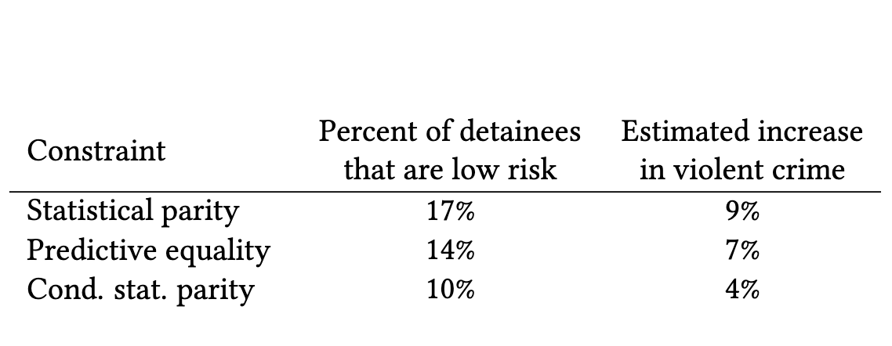

# Introduction

Algorithm has been used regularly by the judges to decide whether defendants should be detained or released while awaiting trial. Although judges are not only dependent on the decision made by the algorithm, they frequently seek help to conclude a decision. Therefore, a high-risk classification, particularly a high-risk misclassification, may have a direct adverse impact on a criminal defendant’s outcome. Therefore, fairness in such algorithms is necessary to reduce such adversity. There are different definitions of fairness in algorithms such as statistical parity, calibration, predictive parity, etc. One of the most popular algorithms that judges use is COMPAS. However, studies from [1] and [2] show that there are racial biases in this algorithm. Both studies indicate that in Broward County, black defendants are substantially more likely to be classified as high risk. [1] through their case studies, show the disparities in algorithms. [2] reformulates algorithmic fairness as constrained optimization with the objective of maximizing public safety while satisfying formal fairness constraints designed to reduce racial disparities. However, they also mentioned that there is tension between improving public safety and satisfying prevailing notions of algorithmic fairness. Therefore, maintaining algorithmic fairness, safety, and model accuracy is challenging. Studies from [3] showed that there is no algorithm or method that can satisfy three fairness conditions. The studies refer to the three conditions of fairness calibration within a group, balance for the negative class and balance for the positive class, which can be achieved in specific cases. [4] deeply analyse the impossibilities of fairness. The study showed that fairness can be guaranteed only with very strong assumptions about the world: namely, that “what you see is what you get,” i.e., that we can correctly measure individual fitness for a task regardless of issues of bias and discrimination. They complement this with an impossibility result, saying that if this strong assumption is dropped, then fairness can no longer be guaranteed.

# Motivation
The notion of fairness in the context of artificial intelligence and machine learning is a multi-faceted and complex problem that consists of several criteria and conditions. These papers discuss the need to quantify algorithmic fairness, talking about the tradeoffs that must be kept in mind, the limitations of such algorithms, and cases where achieving complete fairness can seem impossible. 
Recently, the world of computer science is engaged in a debate regarding fairness in decision-making. Two perspectives are key to this debate: individual fairness and group fairness. Assigning the right amount of weight to each group or individual within a population to ensure unbiased results is still something that demands research. These papers, in general, emphasize the need to ensure that the tools employed by such algorithms are free from quantifiable biases that could result in differential impacts in the contexts in which they are utilized. Two of the papers [3, 4] describe the 

# Methods

There are multiple definition of algorithmic fairness. Common definitions of fairness are statistical parity, conditional statistical parity, and predictive equality. Assume that an algorithm makes decision about the defendants should be detained or release. We denote the decision as $d(x)$, where $x$ is the defendant attributes that are considered for the decision making. We assume that $X$ is the random variable that on values $X = x$ for an individual drawn randomly from the the population of defendants for whom pretrial
decisions must be made. We can formally define the different definition of fairness as follows: 

1. **Statistical Parity**: denotes for an equal proportion of individuals from different groups to be subjected to a specific decision. For instance, equal detention rates among different racial groups. Assume that a person x belongs to the group $g(x)$. For this, statistical parity is defined as follows:
   
    $\[ E[d(X) | g(X)] = E[d(X)] \]$
   
2. **Conditional statistical Parity**: indicates that controlling for a limited set of “legitimate” risk factors, an equal proportion of defendants are detained within each race group. Let, $l(x)$ is the legitimate risk associated with person $x$.

   $\[ E[d(X) | l(X), g(X)] = E[d(X)] \]$

3. **Predictive equality**: means that the accuracy of decisions is equal across race groups, as measured by false positive rate (FPR). This condition means that among defendants who would not have gone on to commit a violent crime if released, detention rates are equal across race groups. Assume that $Y$ is a random variable where $y = 1$ for those defendants who would have committed a violent crime if released, and $y = 0$ otherwise. Formally, predictive equality means

   $\[ E[d(X) | Y=0, g(X)] = E[d(X) |Y=0] \]$

## Formulation of algorithomic fairness using constrainted optimization

As there exists multiple definition of fairness, there should be some criteria to select one. In making this choice, authors [2] assume policymakers seek to maximize a specific notion of utility. In context of pretrial setting, there must be a balance between the benefit of preventing violent crime committed by released defendants and the social and economic costs of detention. To capture these costs and benefits, authros of [2] define the immediate utility of a decision rule as follows

**Immediate utility** For $c$ a constant such that $0 < c < 1$, the immediate utility of a decision rule $d$ is:
  $\[ u(d,c) = E[Y(d(X))-c d(X)] \]$

This can be further written as $u(d,c)=E[d(X)(P_{Y|X}-c)]$, where $P_{Y|X}$ denotes the probability that the defendant will commit crime if released. This shows that it is
beneficial to detain an individual precisely when $P_{Y|X}>c$.

Optimal decision rules $\( d^* \)$ that maximizes $u(d,c)$ under various fairness condition are unique and have following form:

**Unconstrained Optimum**
 $d^*(X) = 1$ if $P_{Y|X} \geq c$ and $0$ otherwise

**Statistical Parity**
$d^*(X) = 1$ if $P_{Y|X} \geq t_{g(X)}$ and $0$ otherwise, where $t_{g(X)}$ are constants that depend only on group membership. The optimal rule satisfying predictive equality
takes the same form, though the values of the group-specific thresholds are different.

**Predictive Equality** The optimal decision rule $ d^*(X)$ satisfying predictive equality takes a similar form to the statistical parity case, with group-specific thresholds.

**Conditional Statistical Parity** $d^*(X) = 1$ if $P_{Y|X} \geq t_{g(X),l(X)}$ and $0$ otherwise, where $t_{g(X),l(X)}$ are constants dependent on group membership and legitimate attributes.

In summary, for statistical parity and predictive equality, the optimal algorithms detain defendants when $P_{Y|X}$ exceeds a group-specific threshold. For example, black defendants might be detained if $P_{Y|X}\ge 0.2$, and white defendants detained if $P_{Y|X}\ge 0.1$. The exact thresholds for statistical parity differ from those for predictive equality. For conditional statistical parity, the thresholds in the optimal decision rule depend on both group membership and the “legitimate” factors.

## Fairness Properties for Risk Assignments
Risk assignments in alogrithm is challenging. Model assign risk based on different assumptions which are case specific. Authors [3] identifies three properties of fairness for risk assignments (s(X)) to be fair as follows:

**Calibration within groups** means that among defendants with a given risk score, the proportion who reoffend is the same across race groups. Formally, calibration means,
  
  $p(Y=1|s(X),g(X))=p(Y=1|s(X))$
  
**Balance for the negative class** requires that the average score assigned to individuals of one group who belong to the negative class is the same as the average score assigned to individuals of another group who belong to the negative class.
  
  $E[s(X) | Y=0, g(X)] = E[s(X)|Y=0] $
  
**Balance for the positive class** symmetrically requires that the average score assigned to individuals of one group who belong to the positive class is the same as the average score assigned to individuals of another group who belong to the positive class.
  
  $E[s(X) | Y=1, g(X)] = E[s(X)|Y=1] $

# Key Findings

### Unfairness in existing COMPAS algorithm

***Assess Fairness***

To assess fairness, we can use the following equation which relates false negative rate and false positive rate. Given that S={HR,LR} is random variable indicates the risk factor. There are two possible values of S that is HR (high risk) and LR (low risk). FNR and FOR are defined as follows:

   $FNR = p(S = LR | Y = 1)$
   
   $FPR = P(S = HR | Y = 0)$
   

This straightforward equation implies that a test-fair score S cannot have identical false positive and negative rates across groups when the recidivism incidence varies.
This finding helps us to comprehend why the ProPublica writers saw significant differences in FPR and FNR between defendants who were Black and those who were White.

 
***Assess Disparate Impact***

Disparate impact under penalty policies where high-risk assessments result in stricter penalties is the consequence of differences in false positive and false negative rates between groups.
The higher recidivism prevalence group will often have a higher FPR and a lower FNR when employing a test-fair RPI in populations where recidivism prevalence varies across groups. Furthermore, it's evident that this would lead to harsher punishments for defendants in the higher prevalence group, both for repeat offenders and non-repeaters.

The figure above displays a plot of false positive rates for defendants charged with misdemeanor offenses, the least serious category of criminal offenses, over various ranges of prior counts. It is evident that disparities in false positive rates between White and Black offenders continue throughout previous record segments.

 
In the above figure, COMPAS decile score distribution isn't normal, a better approach is to equate % non-overlap with total variation distance. This involves comparing score distributions across races and recidivism outcomes, allowing for a precise boundary on disparate impact. Essentially, it shifts from a standard normal assumption to a more robust method reflecting the actual score distribution characteristics.

***Fairness costs risks***

Author [2] show that even though fairness can be achieved, the risk of crime in society can increase. Using the constraints optimization of algorithmic fairness, the effect can be mitigated. However, there exists a trade-off between risk and fairness. 

For each fairness constraint, Figure 1 shows that violent recidivism increases while low risk defendants are detained. For example, when we enforce statistical parity, 17% of detained defendants are relatively low risk. An equal number of high-risk defendants are thus released (because we hold fixed the number of individuals detained), leading to an estimated 9% increase in violent recidivism among released defendants. There are thus tangible costs to satisfying popular notions of algorithmic fairness.

# Critical Analysis

Biases in existing algorithm
Trade-off between bias and risks

# Critical Analysis

## Reference
[1]. Fair prediction with disparate impact: A study of bias in recidivism prediction instruments. A. Chouldechova, 2016

[2]. Algorithmic decision making and the cost of fairness. S. Corbett-Davies, E. Pierson, A. Feller, S. Goel, A. Huq, 2017

[3]. Inherent Trade-Offs in the Fair Determination of Risk Scores. J. Kleinberg, S. Mullainathan, M. Raghavan, 2017

[4]. On the (im)possibility of fairness. S.A. Friedler, C. Scheidegger, S. Venkatasubramanian, 2017
