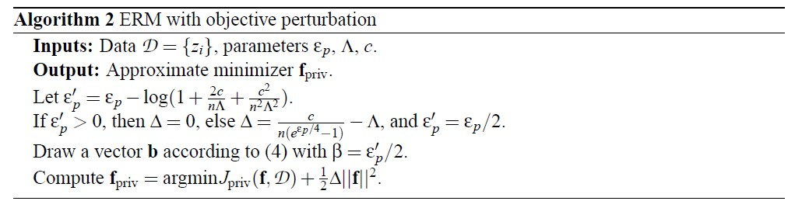
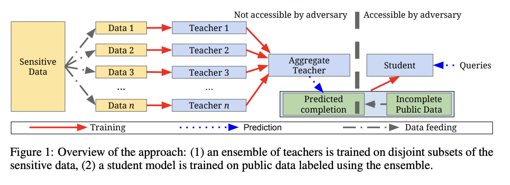
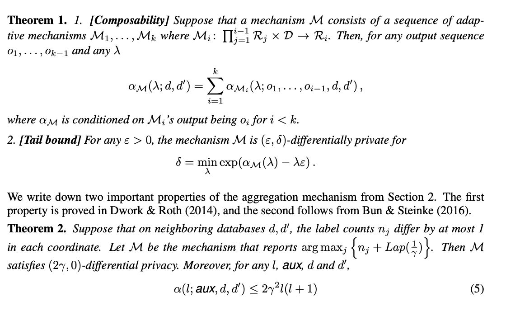
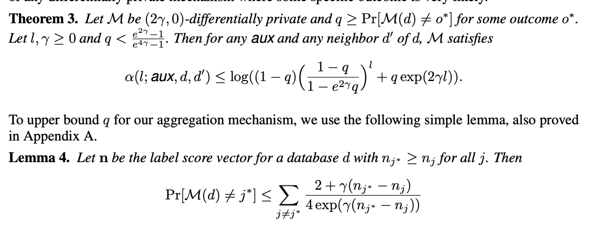
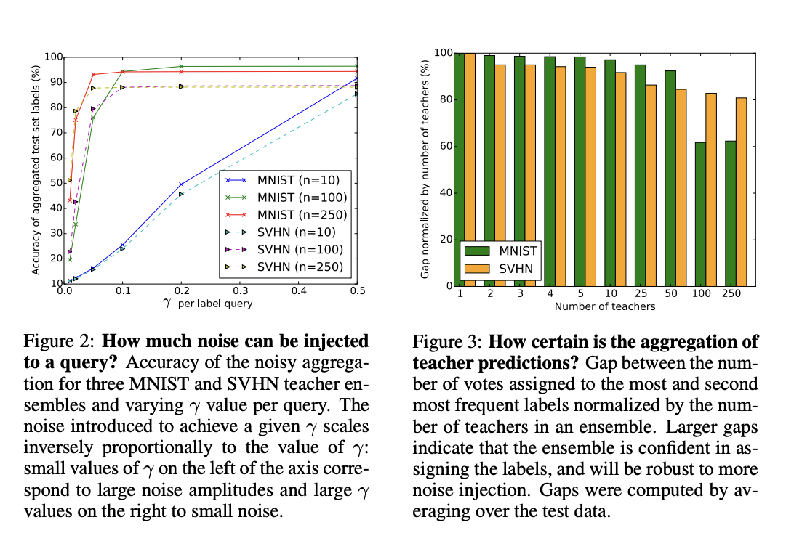
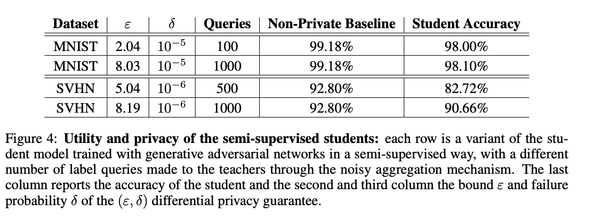

# Introduction
When applying machine learning algorithms to datasets that contain high volumes of sensitive personal data, privacy is a top priority. Technology breakthroughs that make it possible to gather and analyze enormous volumes of data also increase the risk of privacy violations and improper use of personal data. People have a right to anticipate that their data will be treated carefully and in accordance with their right to privacy. Even though machine learning algorithms are effective tools for deriving insights and forecasts from data, if they are not used appropriately, they may unintentionally reveal private information about specific people. As a result, it is crucial to protect personal data privacy at every stage of the data processing pipeline, from data collection and storage to analysis and result distribution.   
Monteleoni et. al. [59] discuss general techniques to create privacy-preserving approximations of classifiers learned through empirical risk minimization (ERM), including regularized ERM. The algorithms proposed in this paper are private under the epsilon-differential privacy definition introduced by Dwork et al. (2006). Theoretical results are provided to show that the proposed algorithms preserve privacy and offer generalization bounds for linear and nonlinear kernels, given certain convexity and differentiability criteria. The results are applied to produce privacy-preserving versions of regularized logistic regression and support vector machines (SVMs). Finally, encouraging results from evaluating the performance of the proposed methods on real demographic and benchmark datasets are presented.

<!-- Introduction for [60] here -->

[61] presents a semi-supervised learning approach called Private Aggregation of Teacher Ensembles (PATE). It protects the privacy of sensitive training data by training an ensemble of teacher models on disjoint datasets.
These teacher models are then used to train a student model without direct access to the sensitive data, ensuring privacy even against adversaries with access to the student model’s parameters. The approach is validated with strong privacy guarantees and high utility on benchmark datasets like MNIST and SVHN.
Further authors demonstrate its applicability to deep learning methods without making assumptions about the learning algorithm.

<!-- # paper 61: SEMI-SUPERVISED KNOWLEDGE TRANSFER FOR DEEP LEARNING FROM PRIVATE TRAINING DATA -->

## Motivation
Paper [59] talks about the exponential increase in the amount of personal data kept in electronic databases across areas such as financial transactions, medical records, search history on the internet, and social network activities which has sparked serious privacy concerns. Although machine learning presents a significant opportunity to extract useful population-wide insights from these datasets, it also poses a key challenge: the unintentional exposure of people's private information. While the anonymization of personal data may appear to be a simple solution at first, the success of this approach is frequently compromised by the survival of distinct "signatures" in the remaining data fields, which allow persons to be re-identified. Thus, adopting more sophisticated techniques for machine learning to preserve sensitive data is required.  
<!-- Paper [60] motivation here -->
Paper [61] addresses the challenge of training machine learning models on sensitive data, such as medical records or personal photographs. ML models often inadvertently memorize and expose private information. The authors aim to develop a method that provides strong privacy guarantees for training data to prevent such unintended disclosures. Key contributions of this work are as follows:

- Introduction of Private Aggregation of Teacher Ensembles (PATE) approach that ensures privacy by aggregating the knowledge of multiple models trained on disjoint datasets.
- Demonstrate the applicability of PATE methods in machine learning algorithms and achieve state-of-the-art privacy and utility trade-offs.
- The use of semi-supervised learning to enhance the student model’s performance without compromising privacy.
- Provision of formal privacy guarantees in terms of differential privacy, ensuring that the student model’s training is not influenced by any single sensitive data point.
- Empirical validation of the approach on benchmark datasets like MNIST and SVHN, demonstrating competitive accuracy with meaningful privacy bounds.
## Methodology

## Modeling Empirical Risk Minimization (ERM)
Let $D \in \left\{ (x_{i}, y_{i}) \in X \times Y:i=1,2...n \right\}$ denote the training data that a machine learning algorithm will be learning from, where ${X = \rm I\!R^{d}}$ and ${Y = \left\{ -1, +1 \right\}}$.
We would like to produce a predictor ${f:X\to Y}$ and the measure the quality of this predictor on the training data using a non-negative loss function ${l: Y \times Y\to \rm I\!R}$.  
In regulared empirical risk minimization (ERM), we choose a predictor ${f}$ that minimizes the regularized empirical loss defined below:
$${J(f,d) = \frac{1}{n}\sum_{i=1}^{n}l(f(x_{i}),y_{i}) + \Lambda N(f)}$$
There are some assumptions to keep in mind when constructing privacy-preserving ERM algorithms:  
1. The loss function ${J(f,d)}$ and the regularizer ${N(.)}$ must be convex. Convex functions are those that satisfy the following property: ${H(\alpha f + (1-\alpha)g) < \alpha H(f) + (1-\alpha)H(g)}$. Strong
convexity plays a role in guaranteeing privacy and generalization requirements
2. Algorithms must satisfy the ${\epsilon_{p}}$ differential privacy model. This model provides a quantifiable framework for measuring the privacy guarantees of algorithms that process sensitive data. It aims to ensure that the presence or absence of any individual's data in a dataset doesn't significantly affect the outcome of the computation, thus preserving the privacy of individuals whose data is included in the dataset.
   
### Approaches for Privacy Preserving ERM
[59] describes two approaches for achieving privacy preserving ERM.
- **Output Perturbation: The Sensitivity Method**
 Inputs: Data ${D}$ with parameters ${\epsilon_{p}, \Lambda}$
 Output: Approximate minimizer ${f_{priv}}$
 Draw a vector ${b}$ with ${\beta= \frac{n\Lambda \epsilon_{p}}{2}}$
 Compute ${f_{priv} = \argmin J(f,D) + b}$, where ${b}$ is random noise with density

- **Objective Perturbation**
 Inputs: Data ${D}$ with parameters ${\epsilon_{p}, \Lambda}$
 Output: Approximate minimizer ${f_{priv}}$
 Similar to the first method, but instead of perturbing the output using sensitivity, we perturb the objective function
 

  

**Private Aggregation of Teacher Ensembles (PATE)**

PATE is an innovative approach that ensures privacy during machine learning model training by aggregating knowledge from multiple teacher models trained on disjoint datasets. It ultimately enables the creation of a student model without direct access to sensitive data. The model has five major components: $(i)$ sensitive data, $(ii)$ teacher models, $(iii)$ student model, $(iv)$ aggregate teacher, and $(v)$ privacy protection. A short description of these components is given below:

+ __Sensitive Data__: This represents the private training data that is divided into multiple disjoint datasets.
+ __Teacher Models__: Each dataset is used to train a separate “teacher” model. These models are knowledgeable about their respective datasets but do not share information with each other to maintain data privacy.
+ __Student Model__: A “student” model is trained using public, non-sensitive data that is labeled based on the aggregated output of the teacher models. The student model learns to mimic the ensemble of teachers.
+ __Aggregate Teacher__: The predictions from all teacher models are aggregated to form a consensus on the output for new data points.
+ __Privacy Protection__: The approach ensures privacy by limiting the student’s exposure to the teachers’ knowledge, which is quantified and bounded.

First, the sensitive data are partitioned into $n$ disjoint datasets. Each dataset is used to train a teacher model and $n$ teacher model is aggregated into a new teacher model. The aggregate teacher model provides the predicted labels. This label is open to use but the aggregate model and data are not accessible by the adversary. On the other hand, a student model is trained on public data using the labels provided by the teacher model. This process ensures that the student model learns to accurately mimic the ensemble without having direct access to the sensitive training data. The student’s training is influenced by noisy voting among the teachers, which is a mechanism to protect the privacy of the training data. The student model can then be deployed for predictions without compromising the privacy of the sensitive data it was trained on. An overview of this approach is shown in the figure below.

  

***Private Learning with ensembles of teachers***

We can divide this into the following 
+ __Training the ensemble of teachers__: Assume (X,Y) is the dataset, where X denotes inputs and Y is the outputs. Let m be the number of the classes in the task. The dataset is partitioned into n disjoint datasets $(X_i, Y_i)$. Further, n classifiers $f_i$ called teacher is trained using $(X_i,Y_i)$. For an input $\tilde{x}$, each teacher provides a prediction $f_i(\tilde{x})$. The label counts $n_j(\tilde{x})$ for a given class $j \in m$ is the number of teachers that assigned class $j$ to input $\tilde{x}$. To ensure privacy, random noise is added to the vote counts using the Laplace mechanism. This process ensures that the student model’s training does not depend on the details of any single sensitive training data point.
+ 
  

  $n_j​(\tilde{x})=∣{i:i\in [n],f_i​(\tilde{x})=j}∣$

    $f(\tilde{x})=\text{arg max}_j​(n_j​(\tilde{x})+\text{Lap}(\frac{1}{\gamma}​))$ ,

  where γ is a privacy parameter and Lap(b) is the Laplacian distribution with location 0 and scale b.

     
+ __Semi-supervised transfer of the knowledge from an ensemble to a student__: The student model is trained using non-sensitive and unlabeled data. Some of this data is labeled using the aggregation mechanism from the teacher ensemble. The student model replaces the teacher ensemble for deployment. Here privacy loss is fixed and does not increase with user queries to the student model. Even if the student model’s architecture and parameters are public or reverse-engineered, the privacy of original training dataset contributors is maintained. Furthermore, the privacy cost is determined by queries made during teacher ensemble training. In addition, various techniques were considered (distillation, active learning, etc.), but the most successful one is semi-supervised learning with GANs (PATE-G).

***Privacy analysis of the approach***

__Privacy Loss__: Assume a randomized mechanism $M$ with domain $D$ and range $R$ satisfies ($\epsilon, \delta$)-differntial privacy if any two adjacent inputs d, $d' \in D$ and for any subset of outputs $S \subseteq R$ it holds that:

$Pr[M(d)\in S]\le e^\epsilon Pr[M(d')\in S]+\delta$

Now let, $M:D \to R$ be a randomized mechanism and $d, d'$ a pair of adjacent databases. Let aux denote an auxiliary input. For an outcome $o \in R$, the privacy loss at o is defined as:

 $c(o; M, aux, d, d') = log \frac{Pr[M(aux, d)=o]}{Pr[]M(aux, d')=o}$ 

The privacy loss random variable $C(M, aux, d, d')$ is defined as $C(M(d;M,aux, d,d'))$ i.e., random variable defined by evaluating the privacy loss at an outcome sampled from $M(d)$.

__Moments accountant__: $\alpha_M(\lambda) = max_{aux, d,d'}$ $\alpha_M (\lambda; aux, d , d')$, where $\alpha_M (\lambda; aux, d , d') = log~E[exp(\lambda C(M, aux, d, d'))]$ is the moment generating function of privacy loss random variable.

Based on this definition, authors provide three theorm as follows:

  

  

From this theorem, we have following properties:

+ Privacy Bounds and Moments:
  + Theorems 2 and 3 provide bounds for specific moments related to privacy.
  + The smaller of these bounds is used, and Theorem 1 allows combining them to derive an (ε, δ) guarantee.
  + Privacy moments are data-dependent, so the final ε value should not be revealed.
  + To estimate privacy cost differentially, smooth sensitivity is bounded, and noise is added to moments.
+ Effect of Number of Teachers on Privacy Cost:
  + Student uses a noisy label (parameter γ) computed in (1).
  + Smaller γ leads to lower privacy cost.
  + A larger gap between the two largest values of nj results in a smaller privacy cost.
  + More teachers can lower privacy cost, but there’s a limit: With n teachers, each trains on a 1/n fraction of data, potentially reducing accuracy.

## Evaluation and Result analysis 

For the evaluation of the PATE and its generative variant PATE-G, the authors first train a teacher ensemble for each dataset. The trade-off between label accuracy and privacy depends on the number of teachers in the ensemble. Further, they minimize the privacy budget spent on training the student by using as few queries to the ensemble as possible. The experiments focus on MNIST and SVHN datasets, comparing the private student’s accuracy with that of a non-private model trained on the entire dataset under different privacy guarantees.

***TRAINING AN ENSEMBLE OF TEACHERS PRODUCING PRIVATE LABELS***

The study evaluates how well the MNIST and SVHN datasets can be partitioned without significantly impacting individual teacher performance. Despite injecting substantial random noise for privacy, ensembles of 250 teachers achieve accurate aggregated predictions: 93.18% accuracy for MNIST and 87.79% for SVHN, with a low privacy budget of ε = 0.05 per query. Key findings of this experiments are as follows:
+ __Prediction Accuracy__: For MNIST and SVHN datasets, even with n = 250 teachers, individual teacher test accuracy remains reasonably high. For MNIST, average test accuracy is 83.86% and for SVHN, average test accuracy is 83.18%. The larger size of SVHN compensates for its increased task complexity. These findings highlight the delicate balance between privacy, ensemble size, and teacher accuracy in the context of privacy-preserving machine learning.
+ __Prediction confidence__: Privacy of predictions by the teacher ensemble requires agreement among a quorum of teachers. Data-dependent privacy analysis provides stricter bounds when the quorum is strong. Authors find the gap between the most popular and second most popular label. Even as the ensemble size (n) increases, the gap remains larger than 60% of the teachers, allowing accurate label output despite noise during aggregation (Follow figure 3).

  

+ __Noisy Aggregation__: Authors consider three ensembles with varying numbers of teachers: $n \in$ {10, 100, 250}. Larger ensemble sizes are necessary to mitigate the impact of noise injection on accuracy. The accuracy of test set labels inferred by the noisy aggregation mechanism is reported for different values of ε.
Notably, the number of teachers must be substantial to maintain accuracy despite noise injection. (Follow Figure 2)

***Semi-Supervised Training of the Student with Pprivacy***

To reduce the privacy budget spent on student training, authors are interested in making as few label queries to the teachers as possible. We therefore use the semi-supervised training approach. For MNIST dataset, the student uses 9,000 samples, with subsets of 100, 500, or 1,000 labeled using noisy aggregation and for SVHN, the student has 10,000 training inputs, labeling 500 or 1,000 samples. Student performance is evaluated on remaining test samples.  Leveraging semi-supervised training with GANs, the MNIST and SVHN students achieve impressive accuracies.
Specifically, the MNIST student achieves 98.00% accuracy with strict differential privacy bound of ε = 2.04 (at $10^-5$ failure probability), and the SVHN student achieves 90.66% accuracy with privacy bound of ε = 8.19 (likely due to more queries to the aggregation mechanism). These results surpass the differential privacy state-of-the-art for these datasets. (Follow Figure 4)

  

## Discussion and Conclusion
+ The paper introduces the PATE approach, which aggregates knowledge from “teacher” models trained on separate data.
+ The “student” model, whose attributes may be public, benefits from this transfer.
+ Demonstrably achieves excellent utility on MNIST and SVHN tasks while providing a formal bound on user's privacy loss.
+ The approach requires disjoint training data for a large number of teachers.
+ Encouragingly, combining semi-supervised learning with precise, data-dependent privacy analysis shows promise.
+ Future work could explore whether this approach reduces teacher queries for tasks beyond MNIST and SVHN.
